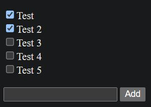

<div align="center">
    <a href="https://todolist-ts-fv.netlify.app" target="_blank">
      
    </a>
  <h3 align="center">Todo List - React / TypeScript</h3>
</div>

##  <br /> 📋 <a name="table">Table of Contents</a>

- ✨ [Introduction](#introduction)
- ⚙️ [Tech Stack](#tech-stack)
- 📝 [Features](#features)
- 🚀 [Quick Start](#quick-start)

##  <br /> <a name="introduction">✨ Introduction</a>

**[EN]** A simple to-do list built from scratch using React, TypeScript, and Snowpack. This project focuses on understanding the core concepts of TypeScript, including static typing, interfaces, and type inference. By incorporating local storage to persist data and leveraging Snowpack for fast development, this hands-on project provides a practical approach to mastering TypeScript fundamentals while working with modern development tools. 

**[FR]** Une simple liste de tâches construite de zéro avec React, utilisant le local storage pour conserver les données. Ce projet décompose les concepts clés de React et les pratiques importantes, offrant une approche pratique pour comprendre les fondamentaux du développement React. 

##  <br /> <a name="tech-stack">⚙️ Tech Stack</a>

- [**React**](https://react.dev/reference/react) is a popular JavaScript library for building user interfaces, particularly single-page applications where data changes over time. React's component-based architecture allows developers to create reusable UI components, making development more efficient and the codebase easier to maintain. 

- [**Local Storage**](https://developer.mozilla.org/en-US/docs/Web/API/Window/localStorage) is a web storage feature that allows web applications to store data persistently in the user's browser. It provides a simple key-value store with a straightforward API, enabling developers to save data across browser sessions without expiration. Local Storage is ideal for storing user preferences, session data, and other non-sensitive information. Its synchronous API makes it easy to use, though it is limited to storing string data only and has a size limit of around 5MB per domain.

- [**TypeScript**](https://www.typescriptlang.org/docs/) is a statically typed superset of JavaScript that adds optional type annotations to enhance code quality and maintainability. It enables early detection of errors through its type system, allowing for more robust and scalable applications. TypeScript integrates seamlessly with JavaScript, providing a gradual learning curve and tooling support that improves the development experience. It compiles to plain JavaScript, ensuring compatibility with existing JavaScript codebases and libraries.

- [**Snowpack**](https://www.snowpack.dev/tutorials/quick-start) is a modern front-end build tool designed for fast and efficient development. It uses a build process based on native ES modules, which eliminates the need for bundling during development and enables instant updates through hot module replacement (HMR). Snowpack's minimal configuration and focus on leveraging modern browser capabilities make it an ideal choice for optimizing the development workflow of web applications. It supports various frameworks and integrates easily with existing toolchains.

- [**UUID**](https://www.npmjs.com/package/uuid) (Universally Unique Identifier) is a standard for generating unique identifiers for use in software applications. UUIDs are 128-bit values typically represented as a 36-character string, including hyphens. They are used to ensure unique identification across different systems and applications, making them ideal for scenarios like database keys, session identifiers, and unique object references. UUIDs help avoid conflicts and collisions, providing a reliable way to generate unique values.

- [**Canvas Confetti**](https://www.npmjs.com/package/canvas-confetti) is a lightweight JavaScript library for creating confetti effects in web applications. It uses the HTML5 <canvas> element to render colorful confetti animations, adding a celebratory or festive touch to user interfaces. The library is easy to integrate and customize, allowing developers to control confetti density, colors, and animation properties. It's often used to enhance user experiences with visual effects, such as celebrations or notifications.

## <br /> <a name="quick-start">🚀 Quick Start</a>

Follow these steps to set up the project locally on your machine.

<br/>**Prerequisites**

Make sure you have the following installed on your machine:

- [Git](https://git-scm.com/)
- [Node.js](https://nodejs.org/en)
- [npm](https://www.npmjs.com/) (Node Package Manager)

<br/>**Cloning the Repository**

```bash
git clone {git remote URL}
```

<br/>**Installation**

Let's install the project dependencies, from your terminal, run:

```bash
npm install
# or
yarn install
```

<br/>**Running the Project**

Installation will take a minute or two, but once that's done, you should be able to run the following command:

```bash
npm run dev
# or
yarn dev
```

Open [`http://localhost:8080`](http://localhost:8080) in your browser to view the project.